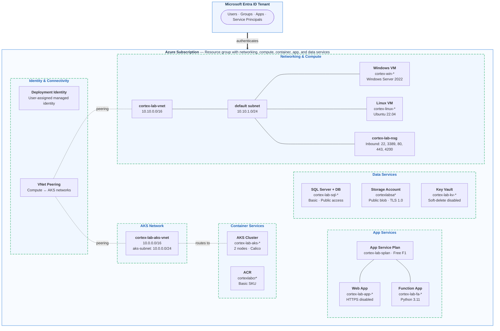

# Cortex Cloud — Azure Cloud Protection Workshop

This workshop walks you through protecting your Azure cloud environment with Palo Alto Cortex Cloud. You will onboard Azure subscriptions, configure cloud posture management, deploy Cortex XDR agents to virtual machines, scan container images, protect AKS workloads, integrate application security and configure SIEM integration.

## Workshop Duration

5–7 hours (can be spread over 1–2 days)

## Prerequisites

* Palo Alto Cortex Cloud tenant with the following modules enabled:
  * Cloud Posture Security
  * Application Security
  * Cloud Runtime Security
* Azure subscription with **Owner** access
* Cortex XDR agent installation packages
* Azure CLI, `kubectl` and Helm installed locally
* A GitHub account (for IaC scanning labs)
* An Azure DevOps organization (for CI/CD integration labs)

## Workshop Modules

| # | Module | Description |
|---|---|---|
| 0 | [Prerequisites](modules/0-prerequisites.md) | Verify accounts, permissions and tools |
| 1 | [Prepare the Environment](modules/1-prepare-the-environment.md) | Deploy Azure lab resources using ARM template |
| 2 | [Onboard Azure Subscription](modules/2-onboard-azure-subscription.md) | Connect your Azure subscription to Cortex Cloud |
| 3 | [Cloud Posture Management](modules/3-cloud-posture-management.md) | Review misconfigurations, compliance and SmartScore |
| 4a | [Protect Linux VMs](modules/4a-protect-linux-vm.md) | Deploy Cortex XDR agent to Linux virtual machines |
| 4b | [Protect Windows VMs](modules/4b-protect-windows-vm.md) | Deploy Cortex XDR agent to Windows virtual machines |
| 5 | [IaC Scanning](modules/5-iac-scanning.md) | Scan ARM, Bicep, Terraform and Dockerfile templates |
| 6 | [Protect ACR Images](modules/6-protect-acr-images.md) | Connect Azure Container Registry and scan container images |
| 7 | [Protect AKS Workloads](modules/7-protect-aks-workloads.md) | Deploy Cortex Cloud defenders to AKS clusters |
| 8 | [Application Security](modules/8-application-security.md) | Scan web applications and function apps |
| 9 | [Container Apps Protection](modules/9-container-apps-protection.md) | Protect Azure Container Instances and Container Apps |
| 10 | [SIEM Integration](modules/10-siem-integration.md) | Integrate with Cortex XSIAM and third-party SIEMs |

## Lab Architecture

The ARM template deploys the following resources into a single Azure subscription and resource group. Resource names include unique suffixes at deployment time; the diagram shows their stable prefixes for readability.

> **Note:** Intentional lab misconfigurations include open NSG rules, permissive SQL exposure, public blob access, and relaxed web app security settings.

### Resources Deployed

| Resource | Name Pattern | Details |
|---|---|---|
| Virtual Network | `cortex-lab-vnet` | 10.10.0.0/16 with default subnet 10.10.1.0/24 |
| AKS Virtual Network | `cortex-lab-aks-vnet` | 10.0.0.0/16 with aks-subnet 10.0.0.0/24 |
| VNet Peering | Bidirectional | Connects compute and AKS networks |
| Windows VM | `cortex-win-*` | Windows Server 2022 Datacenter, Standard_D2s_v3 |
| Linux VM | `cortex-linux-*` | Ubuntu 22.04 LTS, Standard_D2s_v3 |
| NSG | `cortex-lab-nsg` | Inbound rules for ports 22, 3389, 80, 443, 4200 |
| AKS Cluster | `cortex-lab-aks-*` | Kubernetes 1.29, 2 system nodes, Calico network policy |
| ACR | `cortexlabcr*` | Basic SKU, admin enabled |
| App Service Plan | `cortex-lab-splan` | Free F1 tier |
| Web App | `cortex-lab-app-*` | HTTPS disabled, TLS 1.0+ |
| Function App | `cortex-lab-fa-*` | Python 3.11, Consumption plan |
| SQL Server + DB | `cortex-lab-sql-*` | Basic tier, public access, permissive firewall |
| Storage Account | `cortexlabsa*` | Public blob access, HTTPS disabled, TLS 1.0 |
| Key Vault | `cortex-lab-kv-*` | Soft-delete disabled, purge protection disabled |
| Managed Identity | `CortexLabDeployIdentity` | User-assigned, used for deployment automation |
