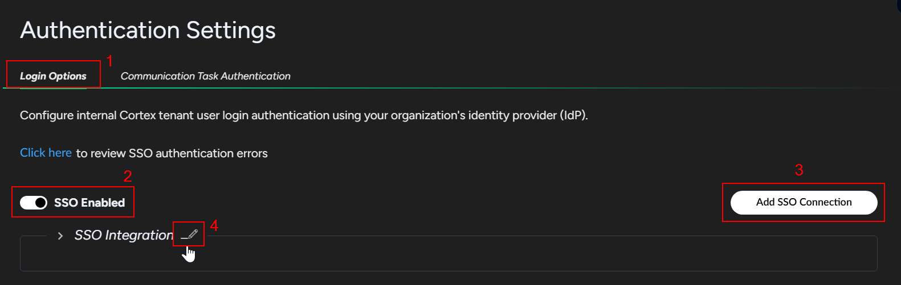
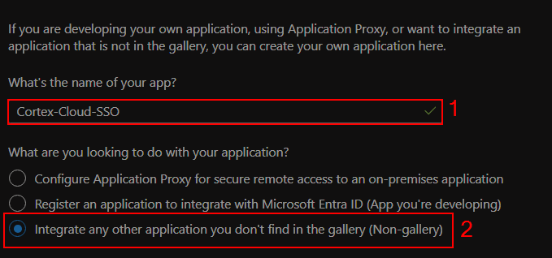
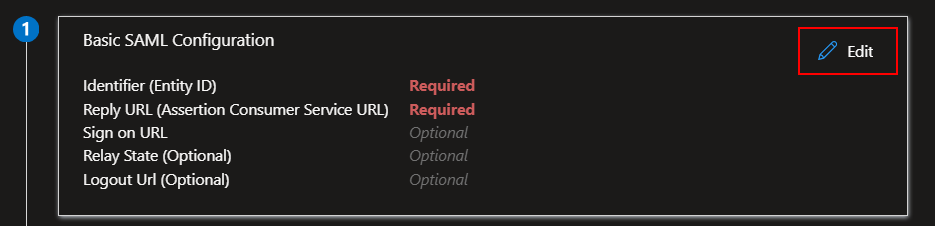
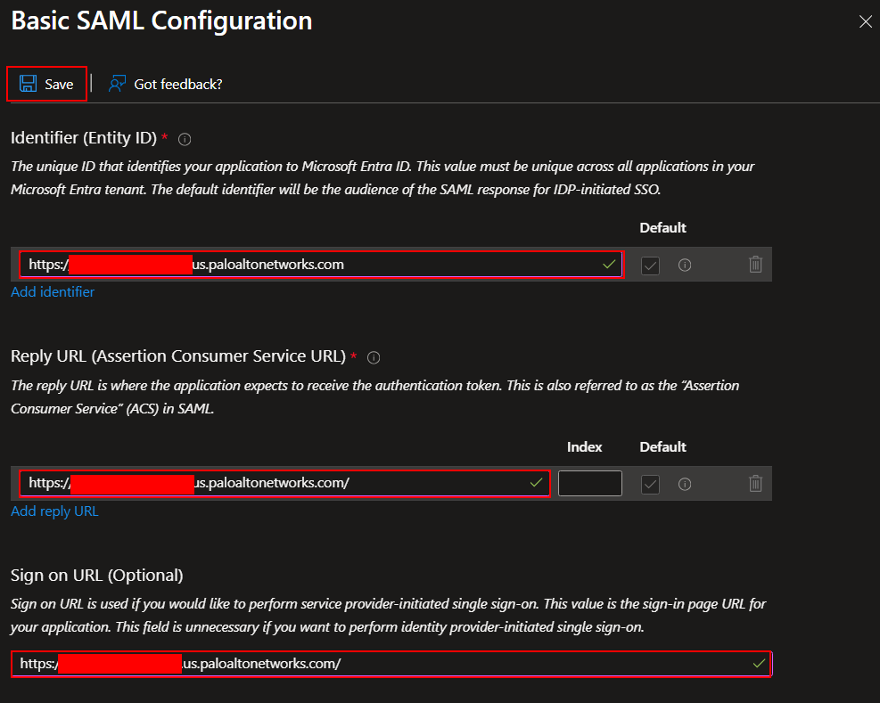
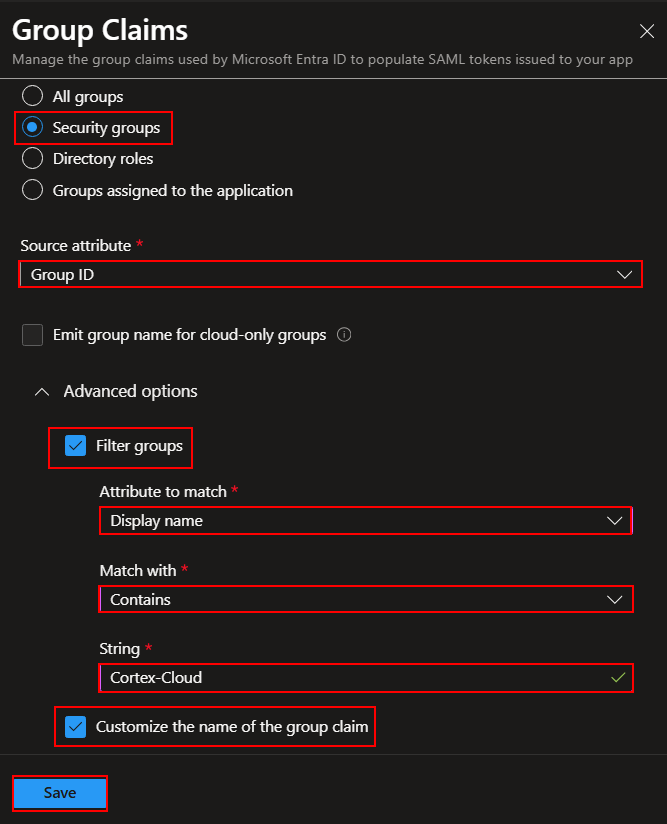
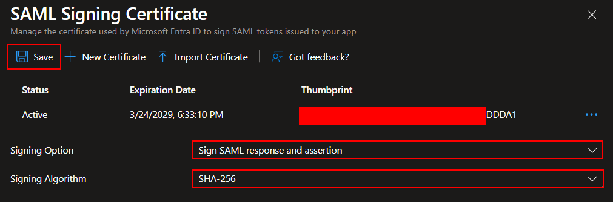
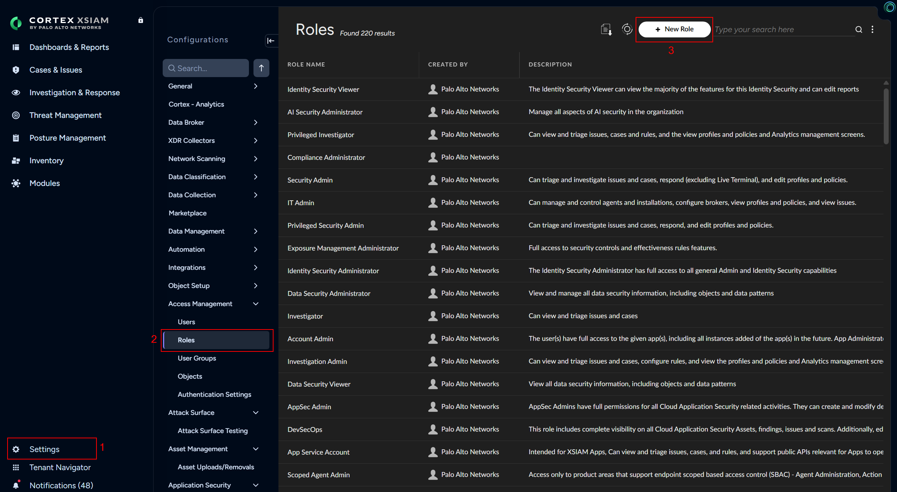
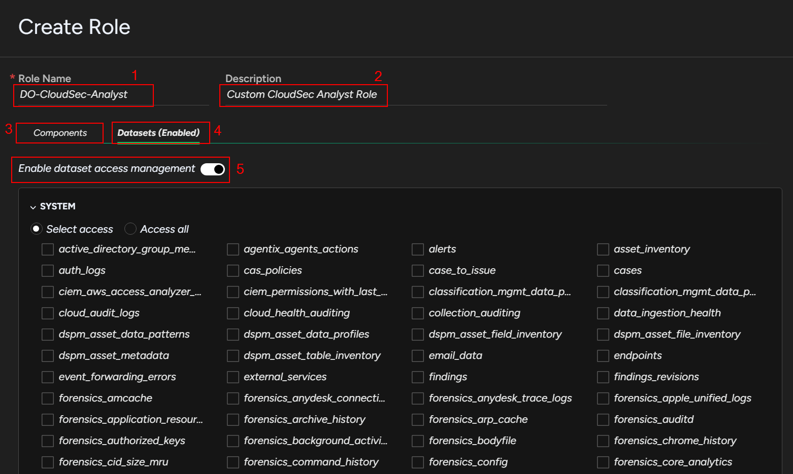

**User Type**:
* Indicates whether the user was defined in Cortex using the CSP, SSO using your organization’s IdP, or both CSP/SSO.

Users (CSP or SSO/IdP) → User roles

**User Roles**
* Can be pre-defined or user created
* Settings → Configurations → Access Management → Roles
* Custom roles can be created to grant access to components and/or datasets (table stores in XSIAM)
* https://docs-cortex.paloaltonetworks.com/r/Cortex-CLOUD/Cortex-Cloud-Posture-Management-Documentation/Set-up-users-and-roles

### Create a user
1. Go to **`Settings`** → **`Configurations`** → **`Access Management`** → **`Users`** → **`New role`** (top right)

### Configure SSO integration with Entra ID
1. Create security groups in Entra ID
* Name: CortexCloud-CloudSec-Analyst

1. Go to **`Settings`** → **`Configurations`** → **`Access Management`** → **`Authentication Settings`** → **`Login Options`** → **`SSO Enabled`**: Enable → **`Add SSO Connection`**
* This adds an SSO Connection box below.
* You can edit the name as needed E.g. DavidO-SSO

2. Expand the box and configure the following:
* Copy the **`Single Sign-On URL`** and the **`Audience URI (SP Entity ID)`**. You will need these later.
  * When copying the Single Sign-On URL value, remove `idp/saml` and leave the trailing `/`.
  * For example, if the Single Sign-On URL is: `https://clientname.panproduct.region.paloaltonetworks.com/idp/saml`, just copy `https://clientname.panproduct.region.paloaltonetworks.com/`.
* **IdP SSO**: Selected

4. Configure the Cortex Cloud app in Entra ID
* Go to **`Entra Admin Center`** → **`Entra ID`** → **`Enterprise apps`** → **`Manage`** → **`All applications`** → **`New application`** → **`Create your own application`**

* In the Create your own application window, configure the following:
  * **What's the name of your app?**: Cortex-Cloud-SSO
  * **What are you looking to do with your application?**: Integrate any other application you don't find in the gallery (Non-gallery)

* After the app is created, click on **`Manage`** → **`Single sign-on`** → **`SAML`** 

* In the **`Basic SAML Configuration`** section, click on **`Edit`**.

* In the **`Basic SAML Configuration`** section, configure the following:
  * **Identifier (Entity ID)**: Paste the value of the **`Audience URI (SP Entity ID)`** from Cortex Cloud
  * **Reply URL (Assertion Consumer Service URL)**: Paste the value of the **`Single sign-on URL`** from Cortex Cloud
  * **Sign on URL (Optional)**: Paste the value of the **`Single sign-on URL`** from Cortex Cloud
  * **Relay State**: Paste the value of the **`Audience URI (SP Entity ID)`** from Cortex Cloud
  * Save (top left)

* In the **`Attributes & Claims`** section, click **`Edit`**, then **`Add a group claim`**. In the **`Group Claims`** window, configure the following:
  * **Which groups associated with the user should be returned in the claim?**: Security groups
  * **Source attribute**: Group ID
  * **Advanced options**:
    * **Filter groups**: Selected
      * **Attribute to match**: Display name
      * **Match with**: Contains
      * **String**: Cortex-Cloud
    * **Customize the name of the group claim**: Selected
      * **Name (required)**: memberOf
      * **Namespace (optional)**: Leave empty
      * Leave other options unselected
  * Save

In addition to group membership, verify that there are also claims for:
Email address = user.mail
First Name = user.givenname
Last Name = user.surname

* In the **`SAML Certificates section`**, click **`Edit`**. Modify the following:
  * **Signing Option**: Sign SAML response and assertion.
  * **Signing Algorithm**: SHA-256
  * Save

* **REFERENCE**: https://docs-cortex.paloaltonetworks.com/r/Cortex-CLOUD/Cortex-Cloud-Posture-Management-Documentation/Set-up-Azure-AD-as-the-Identity-Provider-Using-SAML-2.0

### Create a custom role
1. Go to **`Settings`** → **`Configurations`** → **`Access Management`** → **`Roles`** → **`New role`** (top right)

2. On the **Create role** page, configure the following:
  * **Role Name**: <Your Initial>-CloudSec-Analyst (Replace <Your Initial> with your name initials)
  * **Description**: Custom CloudSec Analyst Role
  * **Components**: Use this to grant `View` OR `View/Edit` rights to various pages in the console.
  * **Datasets (Disabled)**: Use this to grant access to specific tables in XSIAM.
    * **Enable dataset access management**: Enable
  * **Save**

3. You should get a message in the top right that the role was successfully created.

