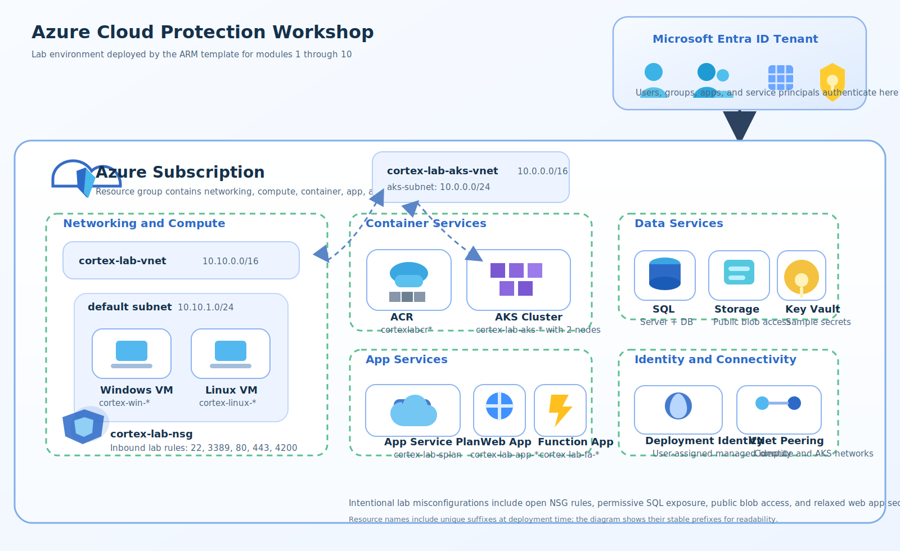

# Module 1 — Prepare the Environment

## Overview

In this module you deploy the Azure lab environment using an ARM template. The template provisions networking, compute, container and application resources that will be used throughout the workshop.

## Steps

### 1.1 — Clone the Repository

```bash
git clone https://github.com/davidokeyode/cortex-cloud-workshop-labs.git
cd cortex-cloud-workshop-labs/workshops/azure-cloud-protection/templates
```

### 1.2 — Deploy the ARM Template

```bash
# Create a resource group
az group create --name cortex-cloud-lab-rg --location eastus

# Deploy the ARM template
az deployment group create \
  --resource-group cortex-cloud-lab-rg \
  --template-file azure-lab-template.json \
  --parameters password='<YourStrongPassword>'
```

> **Note:** Replace `<YourStrongPassword>` with a strong password meeting Azure complexity requirements.

### 1.3 — Wait for Deployment

Deployment takes approximately 15–25 minutes.

```bash
az deployment group show \
  --resource-group cortex-cloud-lab-rg \
  --name azure-lab-template \
  --query 'properties.provisioningState'
```

### 1.4 — Verify Resources

```bash
az resource list --resource-group cortex-cloud-lab-rg --output table
```

## Resources Deployed



| Resource | Name | Details |
|---|---|---|
| Virtual Network | cortex-lab-vnet | 10.0.0.0/16 with multiple subnets |
| VM (Linux) | cortex-lab-linux-vm | Ubuntu 22.04, Standard_D2s_v3 |
| VM (Windows) | cortex-lab-win-vm | Windows Server 2022, Standard_D2s_v3 |
| AKS | cortex-lab-aks | Kubernetes 1.31.1, 2-node system pool |
| ACR | cortexlabacr | Azure Container Registry (Standard SKU) |
| App Service | cortex-lab-webapp | Python web application |
| Function App | cortex-lab-func | Python Azure Function |
| SQL Server | cortex-lab-sql | Azure SQL with sample database |
| Storage | cortexlabstorage | Intentionally misconfigured (public blob access) |
| Key Vault | cortex-lab-kv | Azure Key Vault with sample secrets |
| NSG | cortex-lab-nsg | Intentionally misconfigured (open SSH/RDP) |

## Next Steps

Proceed to [Module 2 — Onboard Azure Subscription](2-onboard-azure-subscription.md).
